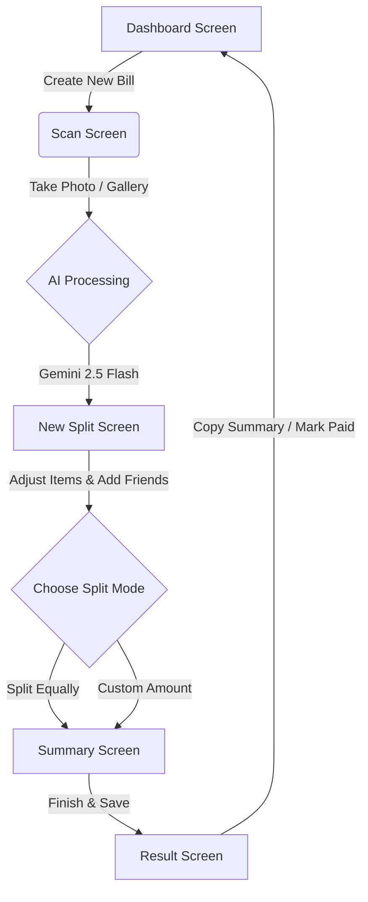

# 🧾 SplitIt - Premium Bill Splitting Application

> แอปพลิเคชันสำหรับหารบิลที่ล้ำสมัย ขับเคลื่อนด้วย AI อัจฉริยะ (Gemini 2.5 Flash) เพื่อการจัดการค่าใช้จ่ายที่ง่ายและรวดเร็วที่สุด


---

## 🌟 ฟีเจอร์หลัก (Key Features)

### 📸 ระบบสแกนใบเสร็จอัจฉริยะ (Next-Gen AI Scanning)

- **Gemini 2.5 Flash Integration**: ใช้โมเดล AI รุ่นล่าสุดของ Google ในการวิเคราะห์และดึงข้อมูลจากใบเสร็จ (Receipt Parsing)
- **High Precision Extraction**: แยกแยะชื่อร้าน, รายการสินค้า, ราคาสินค้าแต่ละรายการ, ยอดรวม (Total), ภาษี (Tax) และ Service Charge ได้อย่างละเอียด
- **Intelligent Category Icons**: ระบบจะตรวจสอบชื่อรายการสินค้าและเลือกไอคอนประกอบให้อัตโนมัติ (เช่น อาหาร 🍽️, กาแฟ ☕, การเดินทาง 🚗)

### ➗ ระบบการหารเงินที่ยืดหยุ่น (Advanced Splitting Engine)

- **Split Equally**: หารเท่ากันทุกคนในคลิกเดียว เหมาะสำหรับมื้ออาหารทั่วไป
- **Custom Amount**: กำหนดราคาเองตามจริงของแต่ละคน (Manual Entry)
- **Remaining Balance Tracker**: ระบบคำนวณเงินที่เหลืออยู่แบบ Real-time เพื่อป้องกันการกรอกเงินไม่ครบตามยอดบิลจริง

### 💎 ประสบการณ์ผู้ใช้ระดับพรีเมียม (Premium UX/UI)

- **Material Design Icons (MDIcon)**: ใช้ระบบไอคอนมาตรฐานสากลเพื่อการแสดงผลที่คมชัดและแม่นยำในทุกอุปกรณ์
- **Responsive Layout**: จัดวางองค์ประกอบแบบ Symmetry มอบความสวยงามและใช้งานง่าย
- **Dynamic Dashboard**: สรุปยอดเงินคงค้าง (OWE / OWED) และประวัติการหารบิลที่ดูง่าย

---

## 🔄 การทำงานของโปรแกรม (App Workflow)



---

## 🤖 การทำงานของ AI (AI Implementation)

ระบบใช้โมเดล **Google Gemini 2.5 Flash** ซึ่งถูกปรับแต่งด้วย **Strict Prompting** เพื่อให้อ่านใบเสร็จได้อย่างแม่นยำ:

1. **Image Pre-processing**: รูปภาพจะถูกย่อขนาดและบีบอัด (Resize & Compress) เพื่อลด Latency และประหยัด Token
2. **Visual Reasoning**: AI จะอ่านข้อความจากภาพใบเสร็จและทำความเข้าใจโครงสร้างราคา (Itemized Prices, Subtotal, Tax)
3. **Strict JSON Output**: AI จะส่งผลลัพธ์กลับมาเป็นโครงสร้างข้อมูล JSON ที่เข้มงวด เพื่อให้แอปนำไปใช้งานต่อได้ทันทีโดยไม่มีข้อผิดพลาด

**ตัวอย่างโครงสร้างข้อมูล:**

```json
{
  "title": "Starbucks Coffee",
  "items": [{"name": "Latte", "price": 125.0}, {"name": "Cake", "price": 150.0}],
  "subtotal": 275.0,
  "tax_or_service_charge": 20.0,
  "total": 295.0
}
```

---

## 🗂️ โครงสร้างโปรเจกต์อย่างละเอียด (Project Structure)

```text
splitit/
├── main.py                    # Entry Point สำหรับเริ่มต้นแอปพลิเคชันและจัดการ ScreenManager
├── requirements.txt           # รายการไลบรารีที่จำเป็นสำหรับการรันแอป
├── .env                       # เก็บ API Key (สำคัญ: ไม่อยู่ใน Version Control)
├── core/                      # ส่วนงานหลังบ้าน (Backend Layer)
│   ├── models.py              # โครงสร้างฐานข้อมูล SQLite โดยใช้ Peewee ORM
│   ├── storage.py             # ฟังก์ชันจัดการข้อมูล (CRUD) เช่น บันทึกบิล, เพิ่มรายชื่อเพื่อน
│   ├── split_engine.py        # ตรรกะการคำนวณเงินสำหรับการหารทั้งแบบ Equal และ Custom
│   └── ai_service.py          # ส่วนเชื่อมต่อและประมวลผลรูปภาพผ่าน Google Gemini 2.5 Flash API
├── screens/                   # ส่วนจัดการหน้าจอแต่ละหน้า (UI Logic)
│   ├── dashboard_screen.py    # หน้าหลักแสดงยอดเงินคงค้างและประวัติบิล
│   ├── scan_screen.py         # ส่วนจัดการกล้องและการส่งรูปให้ AI
│   ├── new_split_screen.py    # ส่วนแก้ไขรายการบิลและเลือกเพื่อนที่จะร่วมหาร
│   ├── summary_screen.py      # แสดง Breakdown ยอดที่แต่ละคนต้องจ่าย
│   └── result_screen.py       # หน้าผลลัพธ์สุดท้าย พร้อมปุ่ม Copy ข้อความทวงเงิน
├── components/                # ส่วนประกอบ UI ที่ใช้ซ้ำได้ (Reusable Components)
│   ├── bill_card.py           # การ์ดแสดงผลบิลในหน้า Dashboard
│   ├── item_row.py            # แถวรายการสินค้าในหน้า New Split
│   └── person_row.py          # แถวรายชื่อเพื่อนและยอดเงิน
├── kv/                        # ไฟล์ตกแต่ง UI (Kivy Language)
│   ├── dashboard.kv           # เลย์เอาต์หน้า Dashboard
│   ├── scan.kv                # เลย์เอาต์หน้า Scan
│   └── new_split.kv           # เลย์เอาต์หน้าหารเงิน (มีระบบ Remaining Balance)
└── assets/                    # ทรัพยากรระบบ
    ├── fonts/                 # ฟอนต์ที่รองรับภาษาไทย
    └── images/                # ไอคอนและรูปภาพประกอบ
```

---

## 🗃️ โครงสร้างฐานข้อมูล (Database Schema)

ใช้ **SQLite** ผ่าน **Peewee ORM** เพื่อความรวดเร็วและไม่ต้องเชื่อมต่อ Server:

| Table | Description |
|:---|:---|
| `Friend` | เก็บรายชื่อ ชื่อเล่น และสี Avatar ของเพื่อน |
| `Bill` | เก็บชื่อร้าน ยอดรวม วันที่ และสถานะการชำระเงินโดยรวม |
| `BillItem` | เก็บรายการสินค้าและราคาในแต่ละบิล |
| `BillParticipant` | เก็บความสัมพันธ์ว่าใครอยู่ในบิลบ้าง ยอดที่ต้องจ่าย และสถานะจ่ายเงินรายคน |

---

## 🧩 ข้อมูลเชิงเทคนิค (Technical Specifications)

โปรเจกต์นี้ได้รับการพัฒนาตามข้อกำหนดของรายวิชาอย่างครบถ้วน โดยมีการใช้งาน Widget และ Callback อย่างหลากหลายเพื่อสร้างประสบการณ์ผู้ใช้ที่ดีที่สุด:

### 🛠️ รายการ Widgets (ใช้งานจริงมากกว่า 30 Widgets)

ระบบมีการเรียกใช้งาน Kivy และ KivyMD Widgets รวมกันเกินกว่า 30 ชนิด เพื่อประกอบเป็นหน้าจอที่สมบูรณ์ ดังนี้:

**Layout & Navigation:**

1. `ScreenManager` - ควบคุมการเปลี่ยนหน้า
2. `Screen` - หน้าจอแต่ละหน้า
3. `MDBoxLayout` / `BoxLayout` - จัดเรียงแนวตั้ง/นอน
4. `MDGridLayout` / `GridLayout` - จัดเรียงแบบตาราง
5. `FloatLayout` - จัดวางอิสระ
6. `ScrollView` - จัดการการเลื่อนหน้าจอ
7. `RecycleView` - แสดงผลรายการจำนวนมาก
8. `RecycleBoxLayout` - เลย์เอาต์ภายใน RecycleView
9. `MDBottomNavigation` - แถบนำทางด้านล่าง
10. `MDBottomNavigationItem` - เมนูในแถบนำทาง
11. `MDTopAppBar` - แถบด้านบนของแอป

**UI Components:**

12. `MDLabel` / `Label` - แสดงข้อความ
13. `MDTextField` / `TextInput` - รับข้อมูลแบบตัวอักษร
14. `MDRaisedButton` - ปุ่มแบบมีพื้นหลัง
15. `MDFlatButton` - ปุ่มแบบโปร่งใส
16. `MDIconButton` - ปุ่มแบบไอคอน
17. `MDFloatingActionButton` - ปุ่มลอยตัว
18. `Button` - ปุ่มมาตรฐาน
19. `MDCard` - การ์ดแสดงผล
20. `MDSeparator` - เส้นแบ่งส่วน
21. `Image` - แสดงรูปภาพทั่วไป
22. `AsyncImage` - โหลดรูปภาพแบบ Asynchronous
23. `Camera` - ดึงภาพจากกล้องถ่ายรูป
24. `MDProgressBar` - แถบแสดงสถานะคำนวณ AI
25. `MDCheckbox` - กล่องสี่เหลี่ยมติ๊กถูก
26. `ToggleButton` - ปุ่มสลับสถานะ (Equal/Custom)
27. `MDDialog` - กล่องข้อความแจ้งเตือนป๊อปอัพ
28. `ModalView` - หน้าต่างซ้อนทับ
29. `MDList` - กลุ่มรายการ
30. `OneLineListItem` - รายการแบบบรรทัดเดียว
31. `Widget` - ตัวยึดพื้นที่เปล่า (Spacer)

### 📞 รายการ Callbacks (ใช้งานจริงมากกว่า 10 Callbacks)

มีการดักจับเหตุการณ์และสร้าง Custom Callbacks เพื่อจัดการ Logic ภายในแอปพลิเคชันอย่างครบถ้วน:

**System Callbacks:**

1. `on_enter()` - ดึงข้อมูลจากฐานข้อมูลเมื่อผู้ใช้เข้าสู่หน้าจอ
2. `on_leave()` - ล้างค่าหรือหยุดการทำงานของกล้องเมื่อเปลี่ยนหน้า
3. `on_press()` - จับจังหวะที่ผู้ใช้เริ่มกดปุ่ม
4. `on_release()` - ทำงานเมื่อผู้ใช้ปล่อยนิ้วจากปุ่ม
5. `on_text()` - อัปเดตยอดเงินทันทีที่ผู้ใช้พิมพ์ตัวเลขใน Custom Mode

**Custom App Callbacks:**

6. `on_scan_press()` - เริ่มตรวจสอบสิทธิ์และเรียกกล้องถ่ายรูป
7. `on_gallery_press()` - เปิดระบบเลือกรูปภาพจากมือถือ
8. `on_ai_result(result)` - ฟังก์ชันจัดการผลลัพธ์ JSON ที่ได้กลับมาจากระบบ Gemini AI
9. `on_add_friend()` - เปิดหน้าต่างเลือกเพื่อนและดึงรายชื่อจาก SQLite
10. `on_split_mode_toggle(mode)` - สลับระบบการคำนวณระหว่างหารเท่ากันหรือกรอกเอง
11. `on_amount_change(amount)` - คำนวณ Remaining Balance ลบออกจากยอดบิลรวม
12. `on_copy_summary()` - สร้าง Template ข้อความแจ้งหนี้และคัดลอกลง Clipboard
13. `on_mark_paid(user_id)` - อัปเดตสถานะการจ่ายเงินลงฐานข้อมูล
14. `on_save_and_finish()` - ทำการ Commit ข้อมูลทั้งหมดลง SQLite และเคลียร์ State

---

## ⚙️ การติดตั้งและเริ่มต้นใช้งาน (Installation)

### 1. การเตรียมสภาพแวดล้อม

```bash
# Clone โปรเจกต์จาก GitHub
git clone https://github.com/psu6810110366/splitit.git
cd splitit

# สร้างสภาพแวดล้อมเสมือน (Virtual Environment)
python -m venv .venv
source .venv/bin/activate  # สำหรับ Mac/Linux
# .venv\Scripts\activate   # สำหรับ Windows
```

### 2. การติดตั้ง Dependencies

```bash
pip install -r requirements.txt
```

### 3. การกำหนดค่า AI (API Key)

สร้างไฟล์ `.env` ไว้ที่ Root ของโปรเจกต์ และเพิ่มข้อความดังนี้:
*(สามารถรับ Key ได้ที่ [Google AI Studio](https://aistudio.google.com/apikey))*

```env
GEMINI_API_KEY=YOUR_API_KEY_HERE
```

### 4. รันแอปพลิเคชัน

```bash
python main.py
```

---

## 📦 รายการ Dependencies (requirements.txt)

- `kivy==2.3.1` (Core UI Framework)
- `kivymd==1.2.0` (Material Design Components)
- `google-generativeai==0.4.0` (AI SDK for Gemini)
- `peewee==3.17.1` (ORM for Database)
- `python-dotenv==1.0.1` (Environment Management)
- `pillow` (Image Processing)
- `pyperclip` (Clipboard Management)

---

## 📄 ใบอนุญาต (License)

โครงการนี้อยู่ภายใต้ใบอนุญาต **MIT License** สามารถนำข้อมูลไปศึกษาและพัฒนาต่อยอดได้โดยอิสระ
